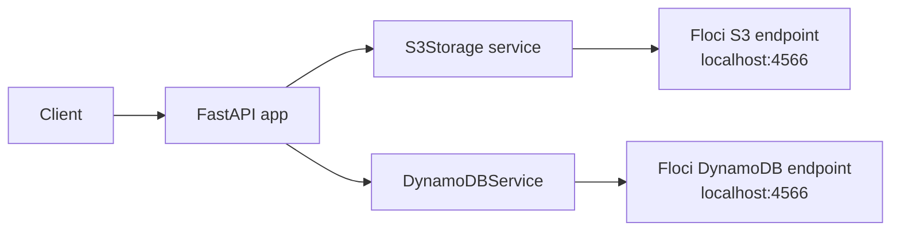

# Document Processing Pipeline

FastAPI backend for uploading and managing documents against AWS-compatible local services through Floci.

The app uses `boto3` with local endpoints on `http://localhost:4566` so you can practice the AWS flow without a real AWS account.

## What It Does

* Upload a document through FastAPI
* Store the file in an S3 bucket named `document-bucket`
* List uploaded documents
* Download a stored document
* Delete a stored document
* Keep the storage layer isolated in service classes

## API Endpoints

The application exposes these routes from `app/main.py`:

| Method | Path | Description |
| --- | --- | --- |
| GET | `/` | Health-style root response |
| POST | `/upload` | Upload a file using multipart form data |
| GET | `/documents` | List files stored in S3 |
| GET | `/download/{filename}` | Download a stored file |
| DELETE | `/documents/{filename}` | Delete a stored file |

### Upload Example

```bash
curl -X POST "http://127.0.0.1:8000/upload" \
    -F "file=@./sample.pdf"
```

### List Documents

```bash
curl "http://127.0.0.1:8000/documents"
```

### Download a Document

```bash
curl -L "http://127.0.0.1:8000/download/sample.pdf" -o sample.pdf
```

### Delete a Document

```bash
curl -X DELETE "http://127.0.0.1:8000/documents/sample.pdf"
```

## Architecture



## Project Structure

```text
app/
    main.py
    routes/
        documents.py
        upload.py
    services/
        dynamodb_service.py
        s3_storage.py
        storage.py
    tests/
        test_dynamodb.py
uploads/
requirements.txt
Dockerfile
docker-compose.yml
```

## Requirements

* Python 3.10+
* Floci running locally on port `4566`
* Python packages from `requirements.txt`

## Setup

### 1. Create a virtual environment

```bash
python3 -m venv .venv
source .venv/bin/activate
```

### 2. Install dependencies

```bash
pip install -r requirements.txt
```

### 3. Start Floci

Start your local AWS-compatible emulator so S3 and DynamoDB are reachable at `http://localhost:4566`.

### 4. Run the FastAPI app

```bash
uvicorn app.main:app --reload
```

Open the interactive docs at:

```text
http://127.0.0.1:8000/docs
```

## How It Works

`app/services/s3_storage.py` creates a boto3 S3 client pointed at Floci and ensures the `document-bucket` bucket exists before uploads run.

`app/routes/upload.py` accepts a multipart file upload and sends it to S3.

`app/routes/documents.py` exposes list, download, and delete endpoints for the stored objects.

`app/services/dynamodb_service.py` is present for metadata work and currently uses the same local endpoint pattern for DynamoDB.

## Notes

* The current upload flow is S3-backed and working through the FastAPI routes above.
* DynamoDB metadata support is in progress and can be extended from the service layer.
* If you change the emulator host, update the `endpoint_url` values in the service classes.

## License

No license file is currently included in the repository.
