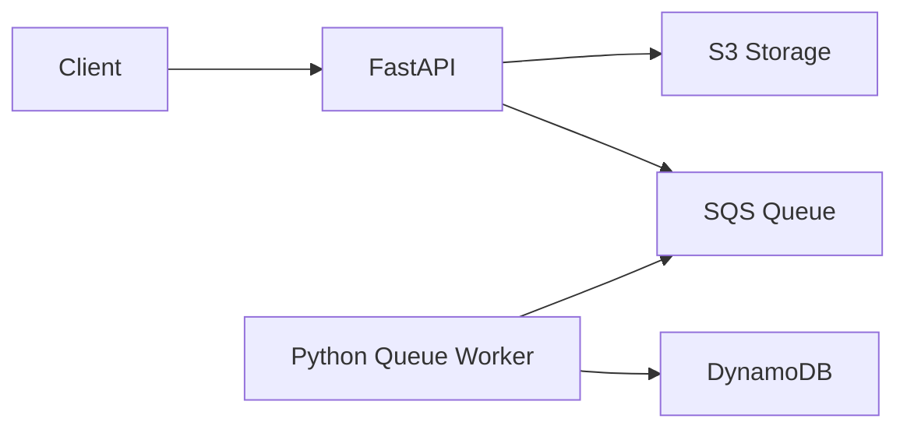

# AWS Document Processing Pipeline

FastAPI-based document processing pipeline for uploading files to S3, publishing document events to SQS, and persisting metadata to DynamoDB from a background worker.

## Project Overview

The API is intentionally thin. It handles request validation, storage orchestration, and queue publication. The worker consumes SQS messages and owns metadata persistence, which keeps the write path to DynamoDB out of the FastAPI layer.

## Architecture Diagram



## Folder Structure

```text
app/
├── main.py
├── config.py
├── logger.py
├── routes/
│   ├── upload.py
│   ├── documents.py
│   ├── health.py
│   └── stats.py
├── services/
│   ├── s3_storage.py
│   ├── sqs_service.py
│   └── dynamodb_service.py
├── workers/
│   ├── queue_worker.py
│   ├── worker.py
│   └── queue.py
└── lambda/
    └── handler.py
```

## Features

- S3 document upload and download
- SQS-backed upload and delete events
- DynamoDB metadata storage from a worker process
- Document listing and deletion
- Health and stats endpoints
- Local AWS emulator support

## Technologies Used

- FastAPI
- Uvicorn
- boto3
- DynamoDB
- S3
- SQS
- python-dotenv
- Docker
- Docker Compose
- GitHub Actions (CI)

## Continuous Integration

This project uses GitHub Actions for continuous integration.

- On every push to `main` and `release/**`, the CI workflow runs automatically.
- On every pull request to `main`, the CI workflow also runs automatically.
- The workflow installs dependencies, verifies Python imports (`python -m compileall app`), and builds the Docker image.

Workflow file: `.github/workflows/ci.yml`

## Local Setup

1. Create and activate the virtual environment.
2. Install dependencies:

```bash
.venv/bin/python -m pip install -r requirements.txt
```

3. Configure `.env` with local AWS emulator values.

Example:

```env
AWS_ENDPOINT=http://localhost:4566
AWS_REGION=us-east-1
AWS_ACCESS_KEY=test
AWS_SECRET_KEY=test
S3_BUCKET=document-bucket
```

## Running Floci

Start the local AWS emulator with Docker Compose:

```bash
docker compose up floci
```

The application expects S3, SQS, and DynamoDB to be reachable at `http://localhost:4566`.

## Running FastAPI

```bash
uvicorn app.main:app --reload
```

## Running Worker

```bash
python -m app.workers.queue_worker
```

The worker receives SQS messages, generates metadata, stores it in DynamoDB, and deletes processed messages.

## API Endpoints

- `POST /upload`
- `GET /documents`
- `GET /download/{filename}`
- `DELETE /documents/{filename}`
- `GET /health`
- `GET /stats`

## Future Roadmap

- Add pagination and filtering for document listings
- Add integration tests against the local AWS emulator
- Add retries and dead-letter queues for worker failures
- Add authentication and authorization
- Split API and worker deployment concerns for production
